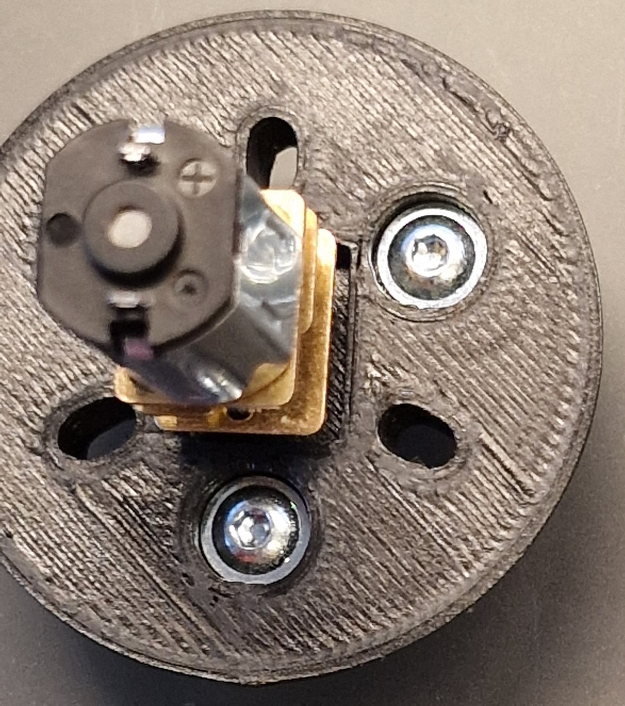
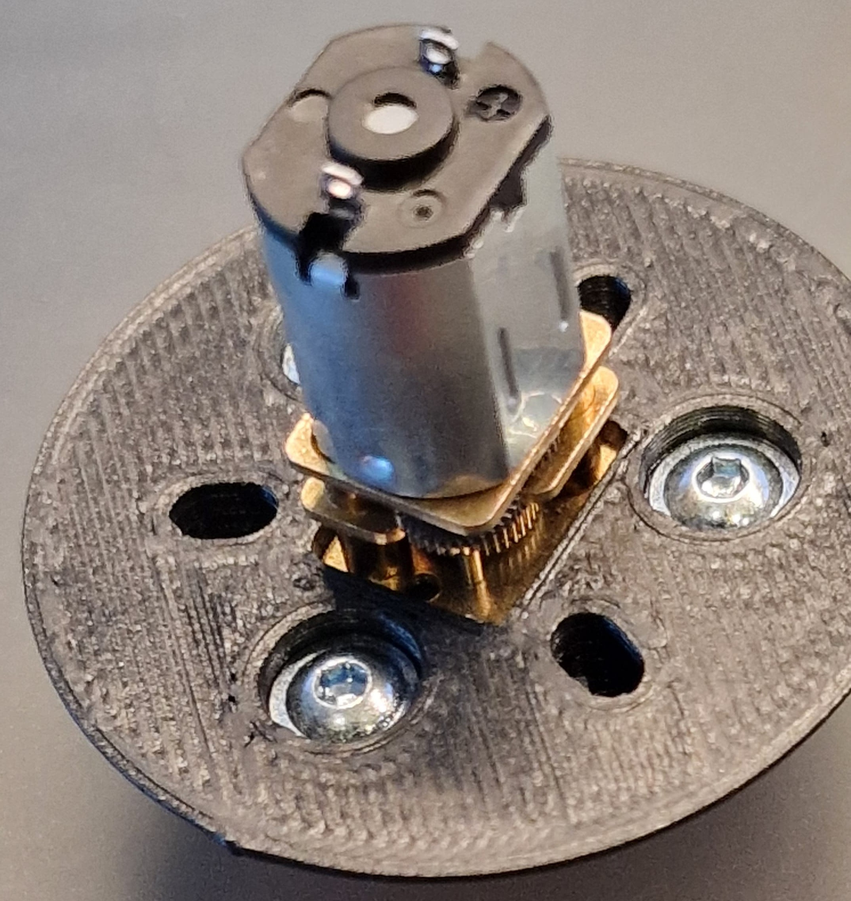
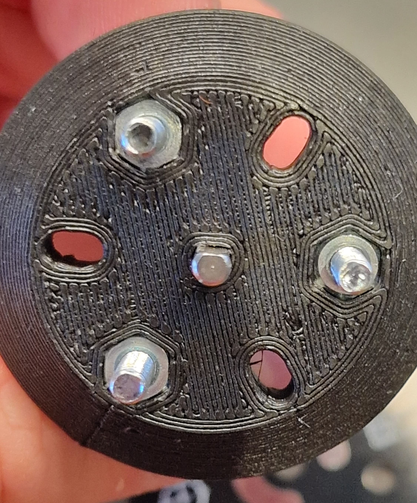
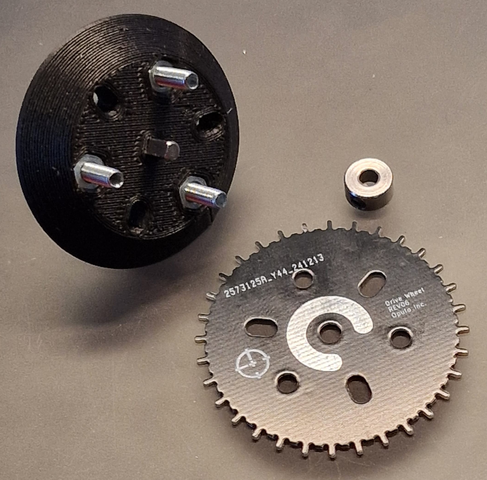
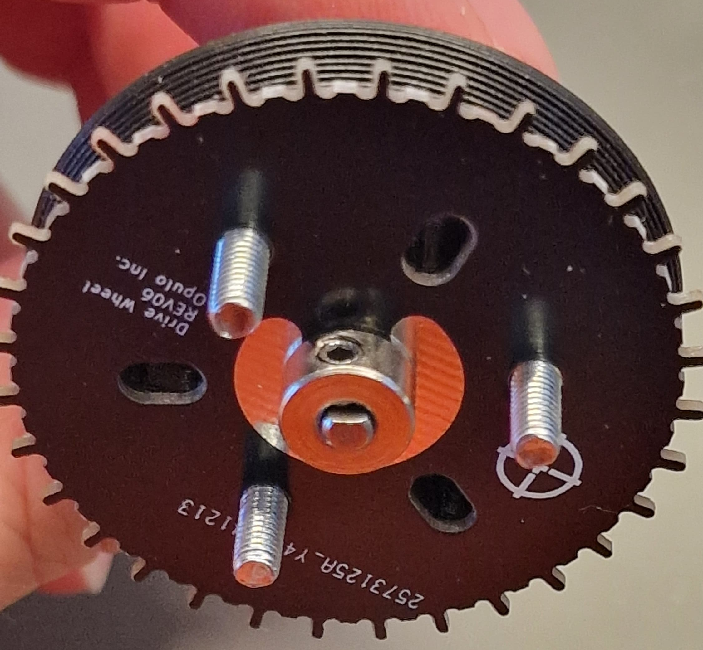

!!! info "Refer to OHAI-Opulo Instructions"
    Always refer to the OHAI-Opulo instructions: [OHAI Opulo Feeder Instruction's](https://ohai.opulo.io/feeder8/indexing-wheel/#glue-shaft-collar-asm-and-drive-wheel-together)

!!! info "Files"
    - You can find both the STL and STEP files on my [GitHub](https://github.com/Technolitix/shaft-aligment-jig.git) for downloading or customizing.  
    - When gluing multiple drive wheels at once (e.g., 30 units), print as many jigs as needed to speed up the process.

# Why This Tool?

The standard jigs for assembling Opulo's drive wheel are often insufficient for precise alignment during the gluing process. That’s why I designed this easy-to-print jig to simplify the task for everyone.

## Features and Benefits

**This is all you need for the jig:**

!!! info "Required Parts"
    - N20 Motor (best use the N20 motors you already have for the peel motor)
    - The jig requires three M3x12mm screws, preferably flat head.  
    - Standard M3x12mm screws can also be used, but they will protrude slightly on the other side. This is perfectly fine if flat head screws are not available.  
    - Three M3 nuts
    - Shaft collar
    - Indexing wheel

**Put the screws and nuts in:**

### Pay Attention

??? warning "N20 Alignment"
    - **Correct**:  
    
    - **Wrong**: Just use your fingernail and rotate the gears inside; the motor will move.  
    - **Don't**: Rotate the shaft into alignment by turning the 3D print—this will deform the print!  
    

Now you can push the motor into its place.

!!! warning "N20 Shaft"
    Be careful when putting the N20 motor shaft into the 3D print. It is designed to be very tight. Use some pressure and a bit of wiggling to get it in the hole. If you have trouble getting it in, use a heat gun or lighter to heat the shaft slightly. Avoid overheating, as this may deform the print and misalign the collar.

**It should look like this:**

**Make sure the indexing wheel is mounted to the jig, facing like in the picture. The glue area should not point to the flat side of the shaft.**

**Now put the shaft collar onto the shaft (slightly screw the set screw in so it won't rotate on the motor shaft). Push the collar onto the indexing wheel and tighten the set screw.**

**Make sure there is no gap between both:**

***After this is done, use the glue and apply it to the glue area as described in [Opulo’s guide.](https://ohai.opulo.io/feeder8/indexing-wheel/#glue-shaft-collar-asm-and-drive-wheel-together)***

!!! info "Adhesive"
    Use a fast-curing adhesive like *Loctite 435* or a similar instant glue to attach the drive wheel components securely.

## Printing Instructions

- **Material**: PLA  
- **Printer**: Ender 3 or similar  
- **Print Time**: Approximately 27 minutes  
- **Infill**: 20%  
- **Supports**: Enabled  
- **Orientation**: Place the smaller circular side flat on the build plate
