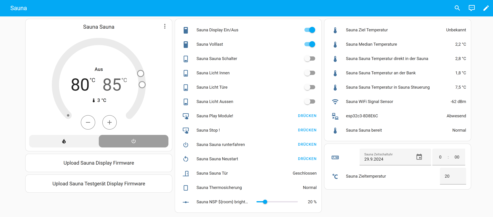

# Sauna Controller



A project for controlling a sauna using sensors and actuators. This application allows precise management of temperature, humidity, and other parameters to ensure an optimal sauna experience.

---

## Features

- **Temperature Control**: Automatically adjusts the temperature based on predefined settings.
- **Humidity Management**: Integrates humidity sensors for maintaining the perfect sauna environment.
- **Scheduling**: Enables the sauna to operate at predefined times.
- **Fallback Mode**: Ensures stable operation even during connectivity issues.

---

## Configuration Overview

The main configuration file is `sauna1.yaml`. It contains all the necessary settings for operating the sauna controller. Sensitive data such as passwords and API keys are managed through references (`!secret`) in a separate file, such as `secrets.yaml`.

Example of a reference in the YAML file:
```yaml
wifi:
  ssid: !secret wifi_ssid_sauna
  password: !secret wifi_password_sauna
```

### Note
The `secrets.yaml` file is not included in this repository. It should contain sensitive data and remain private.

---

## Directory Structure

- **`config/`**: Contains main configuration files like `sauna1.yaml`.
- **`pictures/`**: Contains images for documentation and illustration.
- **`scripts/`**: Scripts supporting sauna control.
- **`logs/`**: Log files for debugging and tracking.

---

## Installation and Usage

### Prerequisites

- A device capable of managing the controller (e.g., Raspberry Pi, ESP32).
- Sensors and actuators compatible with the sauna setup.

### Steps

1. **Clone the repository**:
   ```bash
   git clone https://github.com/Technolitix/Sauna-Controller.git
   ```
2. **Adjust the configuration file**:
   Edit `sauna1.yaml` to suit your sauna's specific requirements.
3. **Configure secrets**:
   Create a `secrets.yaml` file and add sensitive data:
   ```yaml
   wifi_ssid_sauna: "YourWiFiName"
   wifi_password_sauna: "YourWiFiPassword"
   ```
4. **Deploy and start**:
   Upload the configuration to your device and start the controller.


!!! warning "Security"

    - The `secrets.yaml` file should never be included in the repository.
    - Always ensure sensitive data is stored externally and securely.


## Contact

If you have any questions or issues, feel free to open an [Issue](https://github.com/Technolitix/Sauna-Controller/issues).

---

