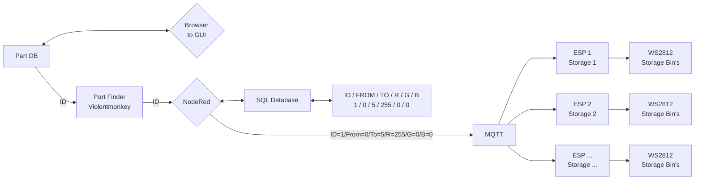

# How is it set up



``` mermaid
graph LR
  A[Part DB] <---> C{Browser
  to GUI};
  A[Part DB] -->|ID| B[Part Finder 
  Violentmonkey];
  B -->|ID| D{NodeRed};
  D <--> G[SQL Database];
  G <--> O[ID / FROM / TO / R / G / B
  1  /  0  /  5  /  255  /  0  /  0  ];
  D ----->|ID=1/From=0/To=5/R=255/G=0/B=0| H[MQTT];
  H ---> I[ESP 1
  Storage 1];
  I --> L[WS2812
  Storage Bin's];
  H ---> J[ESP 2
  Storage 2];
  J --> M[WS2812
  Storage Bin's];
  H ---> K[ESP ...
  Storage ...];
  K --> N[WS2812
  Storage Bin's];
```


### Violentmonkey Code
``` java linenums="1"

```