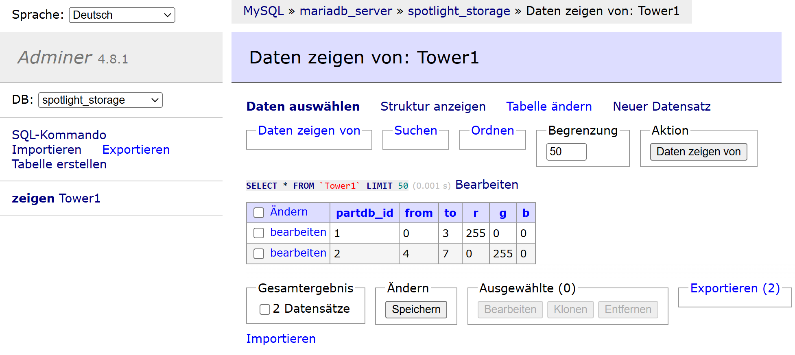
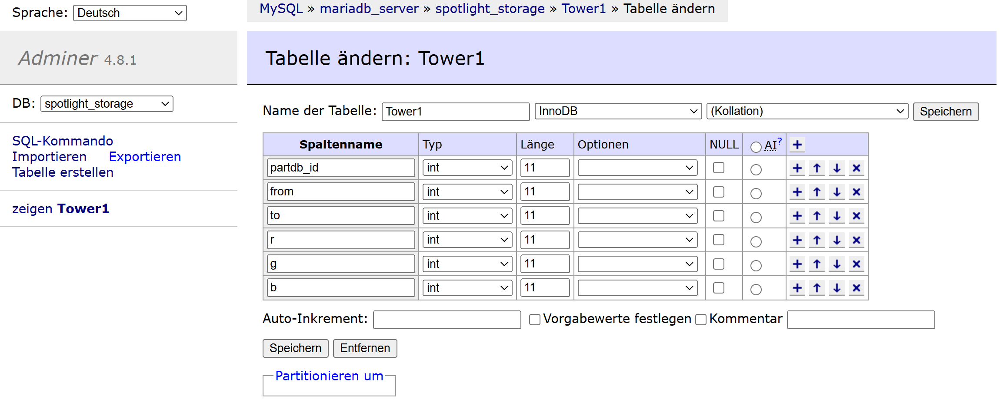
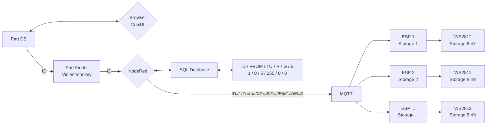
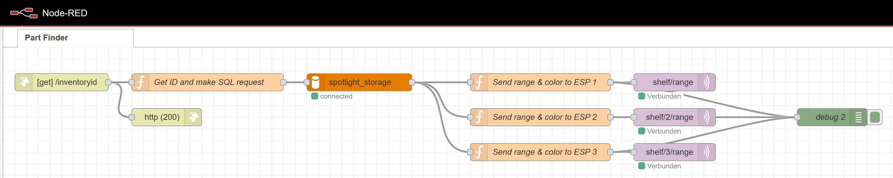

# How is it set up

All needed code is in the [Github Repo](https://github.com/Technolitix/Inventory-System).
It's manly for me, to have some documentation of how I have set all of it up.

### Violentmonkey Browser Plugin
I use this [plugin](https://violentmonkey.github.io/) for google chrome. This uses code to get the Part-DB "ID" of the parts, and send's it to nodered.

### MariaDB
Here I have one table per storage location that shows where a part is located with ws2812 led's.
It contains:

| Variables     |  e.g. | Description                             |
| :-----------: |  :--- | :-------------------------------------- |
| `partdb_id`   |   1   | ID of the part's                        |
| `from`        |   0   | At witch pixel to start the storage bin |
| `to`          |   5   | At witch pixel to stop the storage bin  |
| `r`           |  255  | Color red of the pixel's                |
| `g`           |   0   | Color green of the pixel's              |
| `b`           |   0   | Color blue of the pixel's               |

## System Flow

## NodeRed Flow
